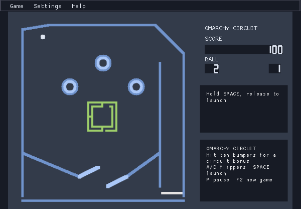

# Omarchy Space Cadet

**Omarchy Circuit** is a self-contained pinball table powered by the SpaceCadetPinball engine. It uses upstream ball physics, collision handling, flippers, bumpers, plunger and drain, with newly authored geometry, artwork and scoring rules.

No Windows game files are needed for default play. This is an original table, not a reconstruction of Space Cadet's table or missions.

## Install and play

Download an Arch package from a successful [Linux build](https://github.com/tcballard/omarchy-spacecadet/actions/workflows/linux.yml), unzip it, and install:

    sudo pacman -U /path/to/omarchy-spacecadet-package.pkg.tar.zst

Or run makepkg -si from the checkout's packaging directory. Open Omarchy Space Cadet from the app menu.

A/D operate the flippers. Hold Space, then release to launch. P pauses, Escape pauses, F2 starts a new game, and F11 toggles fullscreen. Controls are configurable in Settings. This table is single-player; it has three balls, 100-point bumper hits and a 1,000-point bonus for every ten hits.

Settings contains Appearance and Sound. Follow Omarchy uses the active desktop palette. Mute controls the synthesized bumper effect. Circuit has no background music; that option is disabled. The official logo stays unchanged.

## Local data and updates

Update with pacman -U using the newer package. Circuit settings and high scores are separate from classic settings, normally under ~/.local/share/omarchy-spacecadet/circuit/ (respecting XDG_DATA_HOME).

Circuit uses the upstream game's session handling: high scores and settings persist, but an unfinished game does not resume after closing. Previous experimental saves remain untouched.

## Other modes

    omarchy-spacecadet --classic --data-dir /path/to/original-resources
    omarchy-spacecadet --experimental

Classic mode loads your original Space Cadet or Full Tilt resources. Experimental mode preserves the earlier separate physics prototype and its saves. Neither is used for default play.

## Implementation and verification

Authored component records and indexed artwork are built in memory using the upstream DatFile representation. No downloaded original assets are used. A small separate scoring controller handles Circuit events; Space Cadet's mission controller is retained for classic mode.

The default-engine integration test runs 180 simulated seconds through the actual executable, requires bumper scoring and drains, checks finite ball state, and uses no external DAT. CI builds and installs the Arch package and repeats that test against the installed engine. Experimental save-upgrade tests remain separately labelled.

See [table design](docs/ORIGINAL_ENGINE.md), [decisions](DECISIONS.md) and [Arcade standard](docs/ARCADE_STANDARD.md). Real Omarchy desktop checks and hands-on tuning remain. Game code is MIT; official branding retains its owner's rights.

Version tags matching the package version build GitHub prereleases with packages and checksums. A development PR is not a release.
