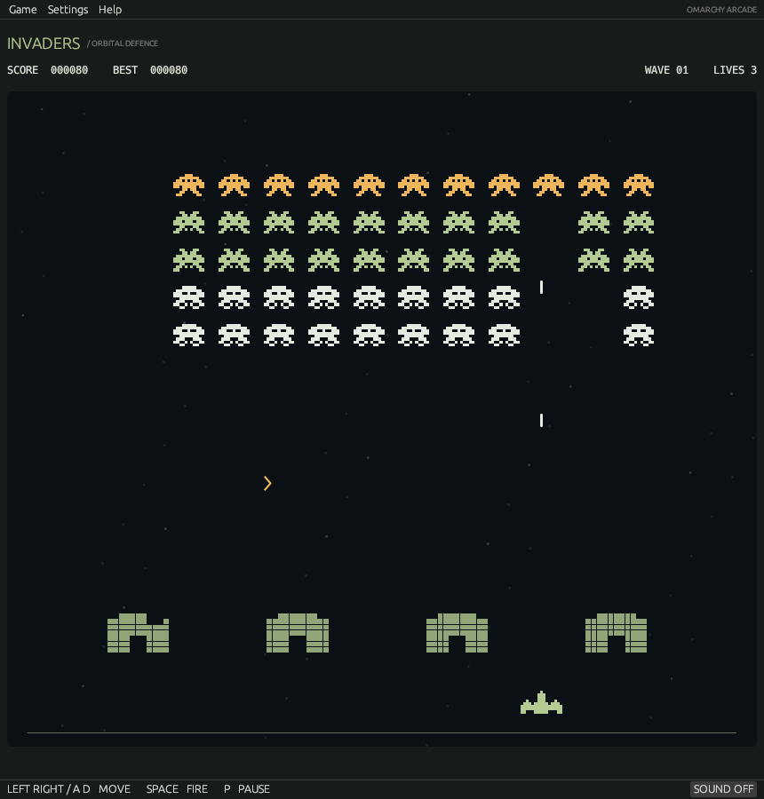

# Omarchy Invaders

A native Rust arcade shooter for Omarchy Arcade. Clear marching alien formations, defend behind destructible bunkers and survive increasingly fast waves.

Development preview. Original pixel sprites, no ROMs or original game resources required.



## Play

- Left/right or A/D to move; hold Space to fire.
- P or Escape to pause. Switching away pauses automatically.
- Ctrl+N starts a new game after confirmation; Ctrl+M toggles sound.
- Ctrl+, opens Settings; F1 opens Help; Ctrl+Q quits.
- Three lives. Formation reaching your ship ends the run. A bonus craft awards 150 points.

## Install on Omarchy

Download the `invaders-arch-preview` artifact from a successful GitHub Actions run on the development PR, unzip it, then:

```sh
sudo pacman -U ./omarchy-invaders-0.1.0-1-x86_64.pkg.tar.zst
```

Launch **Omarchy Invaders** from the application launcher. Package updates preserve local state.

To build from a checkout on Arch, install Rust, pkgconf, libxcb, libxkbcommon, libxkbcommon-x11, libglvnd, wayland and libpulse, then run:

```sh
cargo run --locked --release
```

`./packaging/build-arch.sh` builds an Arch package from the committed checkout. Run as a regular user with build dependencies already installed.

## Local state

Session, high score and preferences live at `$XDG_STATE_HOME/omarchy-invaders/session.json`, defaulting to `~/.local/state/omarchy-invaders/session.json`. Autosave runs every five seconds and on normal exit. Restored games open paused. New games archive the previous session. Invalid saves remain untouched until explicitly archived. A process lock prevents concurrent writers.

Sound is off initially; short synthesized impact cues use `paplay`. Theme colours follow Omarchy, with a dark playfield to keep shots readable. No network connection is needed during play.

## Development

```sh
cargo fmt --check
cargo clippy --locked --all-targets -- -D warnings
cargo test --locked
```

See [decisions](DECISIONS.md) and [verification](docs/VERIFICATION.md). This is a community project, not an official Omarchy bundled application.
