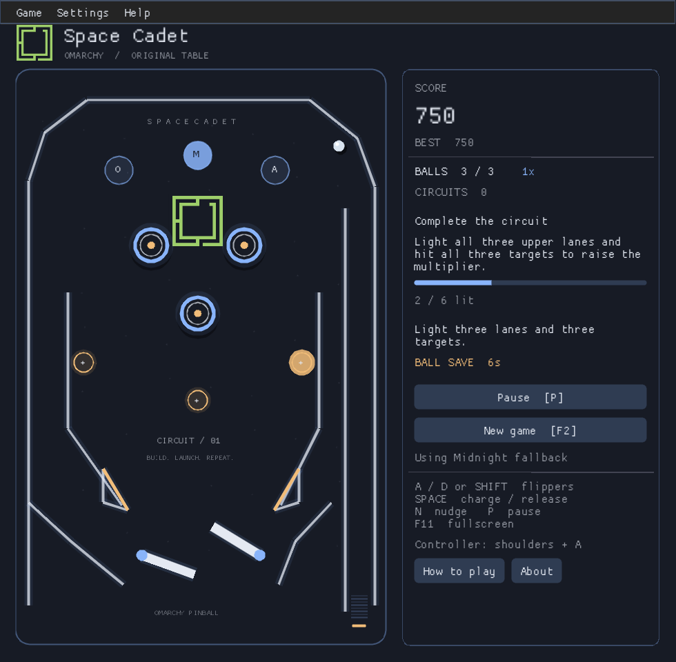

# Omarchy Space Cadet

Open it and play pinball. A native desktop game with an original Omarchy table, official logo, theme colours and synthesized audio. No accounts, downloads or original Windows game files required for the default game.



## Play

- **A / D**, arrow keys or **left / right Shift**: flippers.
- Hold **Space** to charge the plunger; release to launch.
- **N** nudges the table. Repeated nudges cause tilt.
- **P** pauses/resumes; **F2** starts a new game with confirmation; **F11** toggles fullscreen.
- Controllers: shoulder buttons for flippers, A to launch, Start to pause.

Light the three upper O/M/A lanes and hit all three targets to complete a circuit. Each circuit awards a bonus and raises the score multiplier, up to 5x. You have three balls and a short ball-save window after each launch.

Local high scores, appearance/audio preferences and the current game are saved automatically. A recovered game starts paused. Focus loss also pauses play. Mute and optional original synthesized background music are in the side panel.

## Install on Omarchy

Download the `omarchy-spacecadet-arch-x86_64` artifact from a successful [Linux build](https://github.com/tcballard/omarchy-spacecadet/actions/workflows/linux.yml), unzip it, then install its `.pkg.tar.zst` file with `sudo pacman -U /path/to/package.pkg.tar.zst`.

Or build the current checkout:

```sh
cd packaging
makepkg -si
```

This is a development build, not an official Omarchy package.

To update, install a newer package with the same `sudo pacman -U /path/to/new-package.pkg.tar.zst` command. Saves and settings live outside the package, normally in `~/.local/share/omarchy-spacecadet/` on Linux (or under `XDG_DATA_HOME` when set). Keep that directory when updating. CI tests a 0.2.0-to-0.2.1 package upgrade and verifies native restore without changing the saved progress or preferences.

## Omarchy Arcade

The [shared Arcade standard](docs/ARCADE_STANDARD.md) defines direct play, familiar controls, theme/sound behaviour, matching identity and local data. It includes the remaining pinball gaps; collection-wide conformity is not yet verified.

## Two different tables

**Original Omarchy table (default):** new table geometry, rules, physics model, rendered artwork and audio. It uses SDL and the source port's ImGui stack and shared colour handling. This is a complete independently playable table, not a reproduction of Space Cadet's exact layout, missions or physics.

**Classic Space Cadet (optional):** the retained upstream source port with Omarchy colour handling. Run `omarchy-spacecadet --classic` and choose your own original resource folder, or use `--classic --data-dir /path/to/data`. Original resources are neither included nor downloaded. The new original table does not remove this optional mode's resource requirement.

## Appearance and brand

Follow Omarchy reads the current palette from `~/.local/state/omarchy/current/theme/colors.toml`, with XDG state and older configuration-path support. Directory replacement on theme changes is handled by reopening the path. You can choose Midnight or Amber, or use `SPACECADET_THEME_FILE` to select a colours file.

The official [Omarchy logo and wordmark](https://omarchy.org/brand/) are included unchanged. The logo remains its official green, including under different palettes. Brand assets retain their owner's rights; see [provenance](assets/brand/README.md). This is an independent community application.

## Development and verification

```sh
cmake -S . -B build -G Ninja -DCMAKE_BUILD_TYPE=Release -DCMAKE_INSTALL_PREFIX=/usr
cmake --build build --parallel
ctest --test-dir build --output-on-failure
SDL_VIDEODRIVER=dummy SDL_AUDIODRIVER=dummy bin/omarchy-pinball --smoke 600
```

The original table is built into `bin/omarchy-pinball`. The classic engine is `bin/omarchy-spacecadet-game`.

Tests cover physics interactions, rules, a three-minute simulated run, save validation, launcher selection and theme paths. The actual native app has been run and visually inspected at normal and smaller/light-theme sizes. CI additionally builds/installs the Arch package and runs the installed default game without external resources.

Actual Hyprland, fractional scaling, physical controller and audio listening acceptance remain hardware checks. See [DECISIONS.md](DECISIONS.md) for the recorded trade-offs and [README.upstream.md](README.upstream.md) for the original source port.

Version tags matching the package version build a GitHub prerelease with the Arch package and SHA256SUMS. Until a tag is published, use the development artifacts above. Appearance and sound are under Settings; rules and version/credits are under Help.
