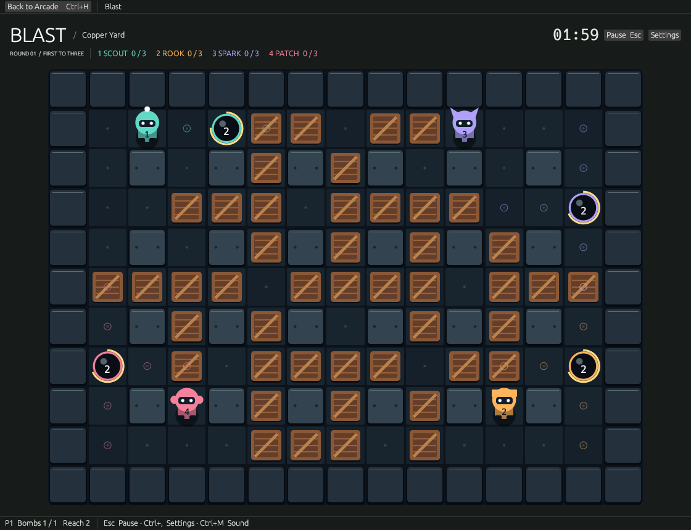
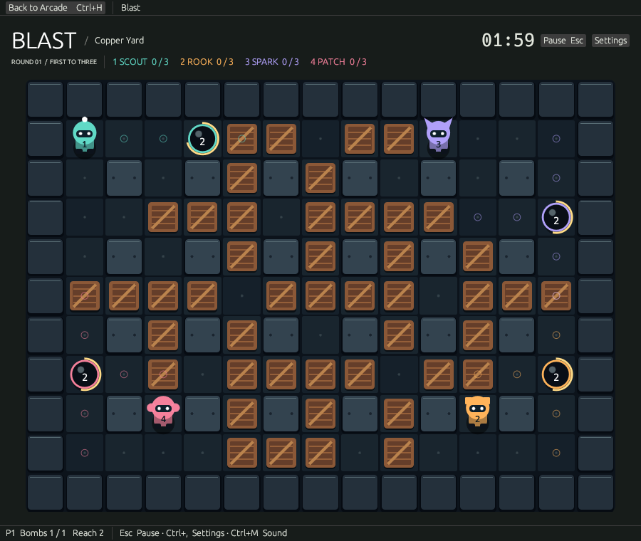
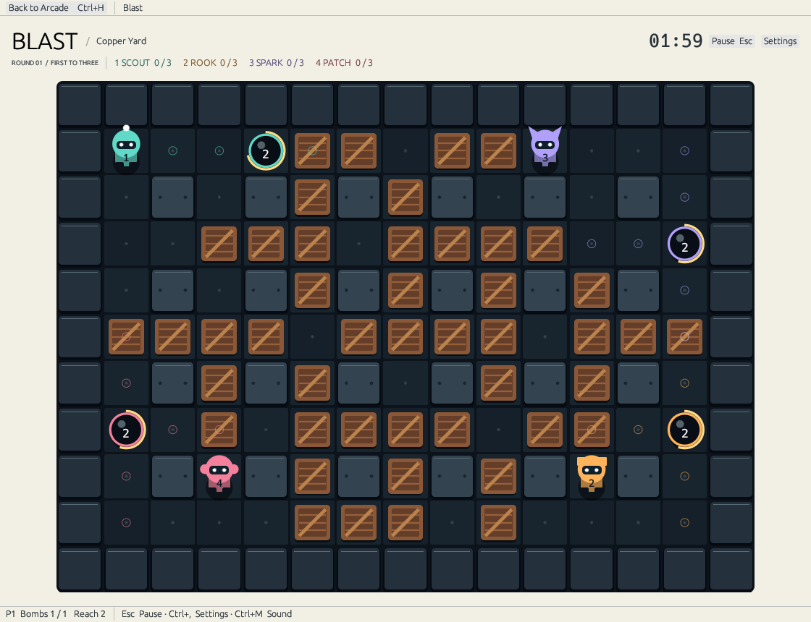
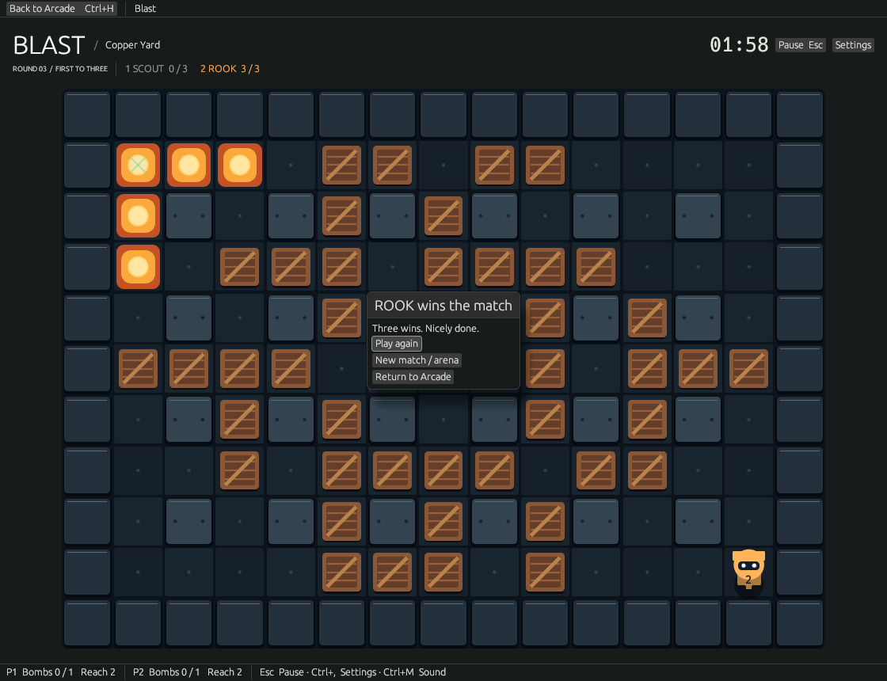

# Blast

An original bomb arena inside Omarchy Arcade. Open Blast from the shared shelf, choose Copper Yard, Crossroads or The Foundry, and start a match. Solo always faces three bots; local two-player supports zero, one or two bots. First to three round wins takes the match. Draws award no point.

| Action | Default |
| --- | --- |
| Player 1 | WASD, Space to place a bomb |
| Player 2 | Arrow keys, Enter to place a bomb |
| Pause everyone | Escape; Resume, Restart match, New match, Return to Arcade |
| Settings | Ctrl+, or Settings button |
| Sound | Ctrl+M; initially off, like the existing games |
| Return to shelf | Ctrl+H or Back to Arcade |

Controls are configurable in Settings. Duplicate bindings and reserved shell keys are rejected. Focus loss freezes the simulation and audio until explicit resume. Restart resets all round/match state; records and preferences remain. No in-progress round is restored after closing the app.

Bombs have a 2.5-second fuse, half-second flames and initially two-tile reach. A shrinking fuse ring and a numeric countdown show time remaining. Dotted cells show the current reach clipped by walls/crates. Capacity upgrades cap at four bombs; range upgrades cap at six tiles. Items under active flames cannot be collected. Your newly placed bomb lets you leave its tile once. Players cannot stack or swap through each other; simultaneous attempts at the same destination both stay put.

At two minutes, the arena closes one ring every five seconds. The next ring is marked with gold hatching for three seconds before it closes. Closing walls eliminate everyone on those tiles simultaneously. Characters have individual antenna/ear/fin silhouettes and numbered uniforms as well as colours. Reduced motion disables animated blast accents; no camera shake or strobe effects are used.

Bots inspect the same future blast/chain rules as the game, search safe routes in time, and only place a bomb when it threatens a crate or participant and an escape exists. They cannot anticipate a future human bomb or guarantee survival if another participant blocks their route. There are no difficulty levels or controller service in the current collection.

Preferences and completed-match records use `XDG_STATE_HOME/omarchy-retro-arcade/blast.json` (normally `~/.local/state/omarchy-retro-arcade/blast.json`), written atomically through the existing storage helper. Existing games and their saves are untouched. Blast uses the current collection's per-game settings conventions, Omarchy theme service and desktop `paplay` sound backend. Returning to the shelf drops the game and stops/reaps its audio child.

## Evidence

- Focused simulation and preference tests cover blast clipping, wave-order independence, chained fuse timing, simultaneous draws, movement/bomb collision, item safety/caps, all supported spawn configurations, closing walls, bot escape/refusal, deterministic replays, match reset/counting, conflicts and persistence.
- `scripts/native-blast.py` uses XTest input in the actual Arcade window: solo movement/bomb placement, pixel-stable pause, focus-loss pause and explicit resume, same-window shelf return, P2 arrows/Enter, a complete local first-to-three match, single record update and persistence after relaunch. This is automated interaction, not a two-person playtest.
- `scripts/blast-renders.py` captures live input-driven play at 900×760, 1120×860 with light colours, and 2240×1720 at 200%. Screenshots are actual game windows, not concept images or reconstructed diagrams.
- Workspace tests, formatting, strict Clippy and release build are required alongside the existing native and packaging checks. CI includes Blast in the existing Arch package and exercises a local match after installation.

See [200% gameplay](200-percent.png).

## Desktop acceptance still needed

A real Omarchy/Hyprland session, audible sound, physical keyboard rollover with two people, and longer bot balance playtesting remain hardware/manual acceptance. The automated local match intentionally has P1 lose three rounds to verify transitions and records; it does not establish competitive balance.
