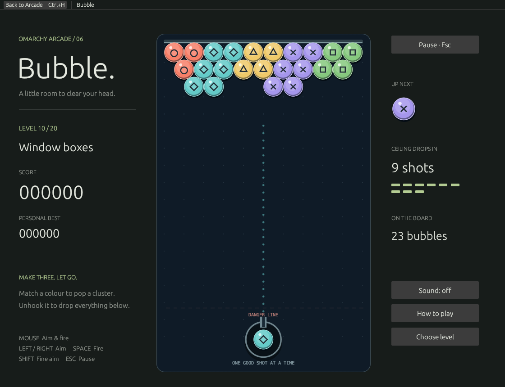

# Bubble

An original bubble-shooting puzzler inside the single Omarchy Arcade window and package.



## Play

| Control | Action |
| --- | --- |
| Mouse / click | Aim / fire |
| Left / Right | Aim |
| Shift + Left / Right | Fine aim |
| Space or Enter | Fire |
| Escape | Pause / resume |
| Ctrl+M | Toggle sound |
| Ctrl+H | Return to Arcade |

The pause menu offers Resume, Restart, an unlocked-level selector and Return to Arcade. Focus loss pauses the current shot; refocusing does not resume it automatically. First-play instructions appear once and remain available from How to play.

Make a connected group of three or more bubbles of one colour. Unsupported clusters fall. Clear the board to win; reaching the danger line loses. A visible shot counter announces the next ceiling drop. The guide shows up to 440 logical units and no more than one wall bounce. Six distinct symbols identify colours independently of hue.

## Progress and audio

Progress is saved atomically to `$XDG_STATE_HOME/omarchy-retro-arcade/bubble.json`, or `~/.local/state/omarchy-retro-arcade/bubble.json`. It records the selected level, unlocked levels, per-level best scores, introduction and sound preference. Reopening a level starts a new attempt. Existing games' paths are untouched. Invalid or future save formats are preserved and reported rather than overwritten.

The collection currently has per-game sound/settings. Bubble follows its Ctrl+M convention and optional `paplay` PCM playback. Its original synthesised cues have an owned child process that is stopped and reaped when pausing, muting or leaving the game. No audio device is required to play.

## Levels and completion routes

`levels/levels.json` defines each name, alternating 10/9-cell rows, a deterministic colour magazine and the shot interval before ceiling pressure. Digits 0–5 are colours; `.` is empty. Magazines fall back to a colour still on the board when their requested colour disappears. Add levels to this file; appended levels retain existing progress.

`levels/routes.json` contains a verified completion route for every level. Angles are degrees from vertical, positive right. The solver uses the production swept-circle collision, snapping, matching, falling and pressure code. Each selected shot also produces the same board at ±0.25°, avoiding single-boundary solutions.

```sh
cargo test -p omarchy-bubble --all-targets
cargo run --release -p omarchy-bubble --example solve
```

The solver prints JSON to stdout and its report to stderr. Review a newly generated route file before replacing the committed one.

## Architecture

- `rules.rs`: deterministic hex geometry, analytic swept shots and board transitions.
- `app.rs`: egui rendering, input, fixed-aspect layout, flight/effects and pause lifecycle.
- `storage.rs`: versioned progress, bounded reads and atomic saves.
- `audio.rs`: original PCM cues and owned playback lifetime.

There is no separate Bubble binary, launcher, desktop entry or release. Artwork is drawn from original vector geometry by the native renderer. `docs/*.png` are actual Arcade captures; later-level QA captures use a preselected unlocked-level save with zero scores.

## Verification

See [the dated handoff](docs/HANDOFF.md) for exact verification and outstanding desktop/package acceptance. Solver playback and Xvfb interaction are automated evidence, not human playtesting on Omarchy.
