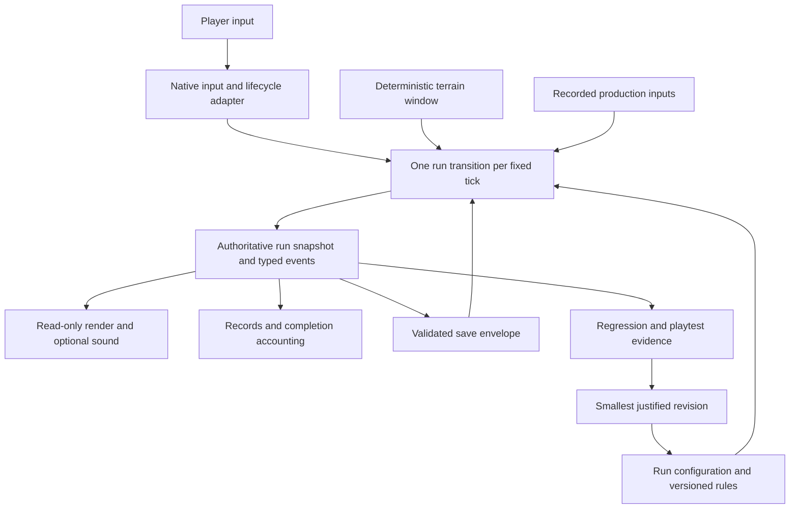

# FreeSki system design

Design direction from the 13 September 2026 agent-ergonomics pass.
This document describes the current system and the target for subsequent work;
proposed interfaces below are not implemented APIs. Scope is FreeSki inside the
existing Arcade host, including its development and acceptance workflow.

## The system we are building

A player chooses a run, reads the slope, makes a steering decision, sees its
consequence and decides to continue. An agent improving the game needs the same
loop: identify the run and rules, reproduce the decision, inspect the consequence,
change one cause and retain evidence. Both loops should use one simulation.

The design should make five questions cheap to answer:

1. What is playable, what did Tyler actually accept, and what remains proposed?
2. What state and rules determine this exact outcome?
3. What is the smallest supported action that reproduces or changes it?
4. Which check distinguishes a fix from a merely different result?
5. What durable example prevents the next contributor from repeating the mistake?

Keep the current movement, original artwork, saves and Arcade integration. Add
abstractions only where multiple callers already need a shared contract or the
next feature introduces a new owner. A generic game framework, separate service,
entity framework or agent-only alternate physics path would add cost here.

## Truth and navigation

| Question | Maintained source |
| --- | --- |
| What should happen next? | [PLAN.md](PLAN.md): status and ordered delivery slices |
| What does the current game do? | [RULES.md](RULES.md), checked against production code |
| Why these numbers; what did a person observe? | [TUNING.md](TUNING.md): active revision and dated feedback |
| Which result was actually demonstrated? | [VERIFICATION.md](VERIFICATION.md): source revision, command, outcome and artifact |
| How should responsibilities fit together? | This document; [NEXT.md](NEXT.md) narrows the next feature |
| Why did the integration contract change? | Root [DECISIONS.md](../../../DECISIONS.md) |
| What was originally proposed? | [REQUIREMENTS.md](REQUIREMENTS.md): historical issue snapshot |

Code is the executable authority for current behavior. A disagreement with the
rules is a discrepancy to resolve, not permission to silently choose the easier
one. Plans specify future work; completed checkboxes do not stand in for evidence.
Historical notes stay dated. Do not copy tuning constants into several active
planning tables or infer human acceptance from an automated run.

## Ownership from input to outcome

| Responsibility | Current owner | Target boundary |
| --- | --- | --- |
| Input source, key release, focus, overlays, wall-clock accumulator | `input.rs`, `app.rs` | Keep in native adapter; emit tick-level intent, not position edits |
| Skier movement, flight, contact, recovery and finish | `engine.rs::Sim` | Keep existing physics; accept prepared world and resolved intent |
| Mode/seed, terrain cache refresh and stepping | Split across `app.rs`, examples and tests | One UI-independent `Session` transition used by all full-run callers |
| Generated geometry | `endless.rs`; static course in `world.rs` | Pure versioned terrain provider; derived cache never authoritative |
| Records and mode replacement | `storage.rs::Save` | Domain progression shared by all callers, persisted by storage adapter |
| Decode, migration, backup, bounded validation and atomic write | `storage.rs` | Persistence adapter; no alternative gameplay decisions |
| Drawing and cosmetic trails | `render.rs`, `app.rs` | Read-only projection of state/events; bounded disposable effects |
| Creature and gates | Not implemented | Mode-specific state evaluated inside the same session tick |

### First extraction, with no behavior change

Introduce a small `session.rs` owner for mode/seed, `Sim` and the derived terrain
window. It refreshes terrain before stepping and after recovery crosses a chunk
boundary, resolves retained keyboard heading at each tick, calls existing physics,
and returns state plus events. Give app, examples and full-run reference checks
this one path. Keep direct engine calls for focused contact/physics unit tests.

Preserve the schema-2 on-disk representation during this ownership extraction.
Explicit conversion at the storage boundary avoids maintaining two mutable copies
of configuration. Establish behavior equivalence before adding chase state.
Current APIs remain supported until their callers move; remove obsolete duplicate
orchestration once the callers have migrated. Do not add a second simulation.

## Contracts that make extensions safe to reason about

### A run has an identity

The authoritative identity is its mode/options, seed or course ID, and applicable
rules/course/generator versions. A fresh seed is chosen outside the simulation
once, then persisted. Future chase-off, chase-on and Slalom records have distinct
keys. Practice remains its own completion/record domain.

A snapshot contains every causal state: skier state and ticks now, objective and
pursuit state when added. Cache contents, UI focus, wall-clock timestamps, textures,
sounds and tracks are derived or cosmetic. Restoring the snapshot must recreate
the same terrain and continuation, with the app initially paused.

### One intent, one tick, one result

A running tick uses fixed simulation time. Paused and terminal sessions do not
advance. Native input ownership is resolved before intent enters the session;
"keep my heading" is resolved against that tick's state, so a crash reset cannot
resurrect the preceding heading within a multi-tick frame.

As new interacting actors arrive, expose event contact fractions within the tick
from the existing collision calculations. Compare relevant contacts before
committing terminal outcomes. Ramp launch precedes a later clearance check;
a fatal collision or catch at/before a finish defeats completion. Define stable
tie handling and never apply one result twice. Preserve the existing rule that a
crash stops movement for the rest of its tick and enters recovery.

The extraction must preserve current results. Any intentional later change to
contact, pursuit or finish semantics gets a rules revision and explicit migration
policy. Rendering consumes events; it cannot award scores or decide catches.

### Terrain is reproducible and bounded

Generator 1 reconstructs whole nearby chunks from identity and position. Stable
IDs are independent of generation order. Retain terrain behind the player for
recovery and future pursuit, and ahead beyond the visible field. New actors may
require a larger spatial query: define its bound from their supported range before
adding it, rather than extending the cache without a limit.

Placement has bounded retries and an omission fallback. The existing seed corpus
proves sampled reference routes, not every possible seed, player trajectory or
braking choice. Extend it with the failing case and relevant boundary classes.
Do not hide impossible terrain by steering an evidence run through obstacles or
changing difficulty only when a test is running.

### Progress outlives an attempt

Completed practice results are accounted once. Replacing an unfinished Free Ski
run preserves its reached distance. Restart, mode switch and future chase toggle
must use the same progression transition; they must not mutate records indirectly
through a rendering or persistence callback.

Storage validates numeric and version bounds before terrain reconstruction,
preserves unsupported files, migrates supported older data with a retained original,
and writes atomically. Future chase fields default to disabled for old Free Ski
saves; old records belong to chase-off. Do not silently substitute a new generator
for an active saved run: retain its implementation or preserve the incompatible
run and offer the existing explicit recovery path.

## Observation and accumulated learning

Current evidence runners use production inputs but repeat some run orchestration;
tick-stamped replay exists as test data, not a reusable replay tool. The next slice
should make that evidence reusable, without exposing developer controls in play.

The proposed headless evidence command takes an initial snapshot, ordered tick
inputs, an explicit tick limit and an output directory. It uses `Session`, validates
input order/finite values, and stops on a terminal state, failure or limit. It
writes a compact summary and, on failure, the first divergent tick and relevant
events/state. A trace cannot bypass collision, inject outcomes or override rules.
Same-build/platform continuation is the promise; arbitrary cross-platform libm
bitwise equality is not currently guaranteed.

A reusable case contains:

- Source revision and rules/generator/course versions; mode/options and seed.
- Initial state and the minimal production-input schedule needed to reproduce it.
- Expected invariant or outcome, first failure tick and actual result.
- Relevant screenshot or clip only when visual/input behavior is in question.
- Tester's observation, measured fact and proposed explanation kept distinct.

Keep small deterministic regressions in the repository. Put bulky captures in CI
artifacts with run/revision references. Temporary local paths remain historical
observations and may expire; they are not a durable regression library. Do not
check in a person's entire state directory, environment dump or raw conversation.

Turn a useful failure into a named case before broadening the next feature.
Examples already worth retaining are the released-heading crash, malformed large
coordinates, stale ramp IDs and a save straddling a chunk boundary. Human feedback
adds an observation and a testable tuning hypothesis, not an assertion that one
reference route represents all players.

## Resource and collaboration budget

Run the smallest discriminating check while editing, then the applicable combined
gates once after integration. [Verification](VERIFICATION.md#choosing-checks) maps
changes to checks; root contributing/CI remain the release authority. Reuse a
passing result only for the same relevant source, inputs and environment. A code
change, failure or new concern invalidates the affected evidence.

When delegation is authorized, assign ownership around contracts: one owner for
session/event semantics, another for a pure actor policy, another for presentation
or evidence after the interface is settled. Each assignment states its files,
inputs, outputs, invariants and acceptance check. Review the combined production
path, not just isolated worker summaries. This document neither authorizes workers
nor fixes a provider/model; follow the user's current delegation instructions.

Local Rust via mise, virtual-display setup and package prerequisites are environment
facts, not game rules. A missing Arch package dependency does not block headless
physics or local native play, but it remains an explicit release gap. Test processes
use isolated state and distinct displays; never reset the player's run to obtain
a screenshot. Keep runtime setup recipes in the verification workflow, not each
feature plan.
