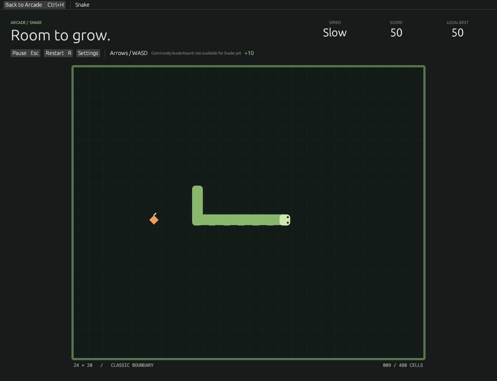

# Snake

A bounded 24 × 20 classic Snake game inside the single Omarchy Arcade window. Three fixed speeds, two-turn buffering, local records and a resumable run. Offline by default and in this release.

Use the shelf, or `omarchy-retro-arcade --game snake`. Enter starts or continues; arrows/WASD turn, Esc pauses, R restarts and Ctrl+H returns to Arcade. Choose 1/2/3 for Slow/Normal/Fast before starting. Settings offer custom direction bindings, reduced motion and short optional original sounds. Focus loss pauses; continuing uses a cancellable countdown.

- [Versioned gameplay, timing and save rules](docs/RULES.md)
- [Shared leaderboard dependency and adapter contract](docs/LEADERBOARD-HANDOFF.md)
- [Verification and native screenshots](docs/VERIFICATION.md)

Run `cargo test -p omarchy-snake` for engine/storage tests, or `cargo test -p omarchy-snake --no-default-features` for the service-compatible replay engine. `scripts/native-snake.py` drives the actual Arcade binary using XTest events. The game has no standalone binary or launcher.

All Snake vector graphics and sound cues are original project code under GPL-3.0-or-later. Existing Arcade artwork is unchanged.
