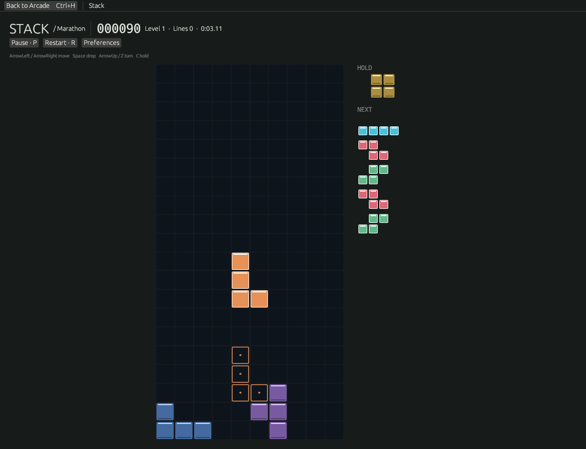

# Stack

A keyboard-first falling-block game inside Omarchy Arcade. Play Marathon for points or Sprint for a 40-line time. Includes deterministic seven-piece bags, ghost, next five, hold, two-way rotation, capped lock delay, configurable controls/repeat, optional sound, reduced motion, pause on focus loss, local records and one exact resumable run per mode.

Default controls: arrows move / soft drop / clockwise rotation, Z anticlockwise, Space hard drop, C hold, P or Escape pause, R restart, Ctrl+H Arcade. Use Preferences to rebind gameplay keys.

[Rules and scoring](docs/RULES.md) · [Leaderboard service](../../services/leaderboard/README.md) · [Hosting approval proposal](../../services/leaderboard/HOSTING.md)

Run `cargo test -p omarchy-stack` for engine, persistence and client recovery checks. Run `scripts/native-stack.py` under Xvfb for native keyboard/focus/shelf checks. These are automated Linux checks; human playtesting on Omarchy remains a separate acceptance step.
