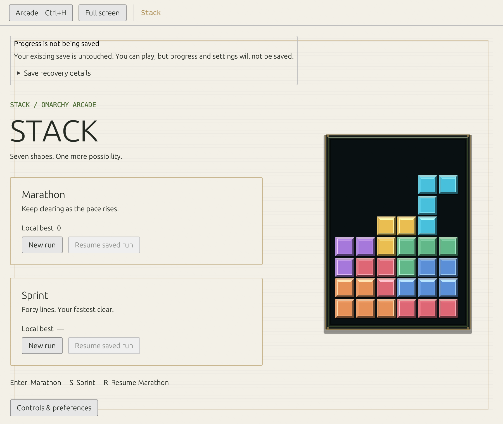

# Stack verification

## Save protection follow-up (12 September 2026)

- Seven save regressions cover invalid/future saves, failed recovery destinations, prior recovery files, failed reads and dangling links, valid records/preferences/both modes, first-run saving and reopening after manual recovery. Four of the initial six tests failed against the original behavior; the fixed Stack suite passes all 26 tests.
- Workspace formatting and strict Clippy pass. All 222 workspace tests pass with a real Stockfish engine required; none are ignored. The release build, three Pinball engine/theme checks and desktop-entry validation pass.
- `scripts/native-stack-save-protection.py` passes under Xvfb in compact dark and light/200% configurations. Real key events exercise unsaved play, periodic saves, pause, shelf return, reopening and normal close while checking original/recovery bytes. The test also rejects the original preview's recovery-file overwrite. It runs in CI and uploads its actual-window captures with the other native evidence.
- Existing Stack native gameplay, both save modes, pause/focus and resize checks pass. Ten-game native switching passes from a staged installation containing the app, both helpers and one desktop entry. That check used an explicit default-theme fixture because the existing theme loader can fall back to the desktop's HOME theme before XDG config.
- On an actual Omarchy/Wayland desktop, launching the rebuilt app with an isolated future-version save, capturing the persistent notice and closing normally preserves the file without creating a recovery copy. This is desktop launch/render/exit evidence; full keyboard lifecycle coverage above is X11 automation, not human play-feel testing.
- No live package reinstall, ARM build or leaderboard deployment was performed for this save-only change. Existing schemas, paths and packaging remain unchanged.

The earlier integration evidence below is retained as historical context.

Implemented in `feat/stack`, based on the five-game consolidation and updated with published `main` through `7c73d08`. Bubble, Blast and Snake remain separate feature work; this branch preserves the existing five games and adds Stack.

## Automated evidence

- Full workspace: 143 tests passed at the initial integration checkpoint; further short-tap and delayed-retry regression tests were added and the affected suites rerun (145 tests in the resulting suite). No ignored tests in that checkpoint.
- Stack: 19 tests covering seven-piece bags, deterministic state, wall/floor/stack rotation, blocked rotation, hold limit, hard drop / ghost agreement, lock reset cap, simultaneous clears and combo scoring, Sprint completion, top-out, exact JSON restoration, movement repeat, replay tampering, audio, offline eligibility, private pending saves, expired retries taps between simulation ticks, and an older retry completing during another run.
- Shared transport and service: six tests including a genuine 40-line Sprint generated entirely through the production input rules; Marathon results; tampering; expiry; impossible events; alias filtering; changed duplicate tickets; exact idempotent retries; tied ranks; rules separation; deletion; blocked identities; real HTTP request/rate bounds; SQLite backup and network failure recovery.
- `cargo fmt --all --check`, workspace Clippy with `-D warnings`, release desktop and service builds pass locally.
- Native X11/XTest: keyboard movement, both rotation directions, hold, hard/soft drops, pause, focus loss, native save/resume, mode separation, resize, shutdown and returning to the same Arcade shelf/window. Run at normal scale, light theme and 200% scaling; screenshots visually inspected.
- Native local service: optional ticket creation, real gameplay to top-out, disclosure, alias entry, explicit consent, replay upload, saved credential, retry cleanup and own score visible in the board.
- Staged package: one desktop entry, six game licences, existing artwork and Pinball executable. Native switching passed across all six games, including Solitaire save preservation and a Stockfish response. Three existing Pinball CTest checks passed (theme palette/path and authored table). The unchanged C++ engine was reused from the verified consolidation build.

Commands are available in `scripts/native-stack.py`, `scripts/native-stack-online.py`, `scripts/native-check.py` and the workspace tests. Screenshots are from the running application, not mockups. The native test setup used Xvfb, software rendering and the existing consolidation's SDL/Stockfish test dependencies.

## Remaining acceptance

Human keyboard/play-feel testing on an actual Omarchy desktop is still required. XTest automation is not human playtesting. The current container is not Arch; the real Arch package job is a GitHub CI gate. Public HTTPS deployment, provider cost approval, encrypted remote-backup restore and production load/health checks remain pending. No public endpoint is enabled.
